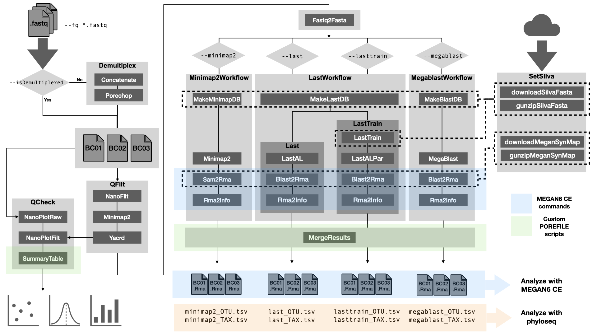

[](https://www.nextflow.io/)
[](https://hub.docker.com/repository/docker/iferres/porefile/general)

# Porefile: a Nextflow full-length 16S profiling pipeline for ONT reads
`Porefile` is a Nextflow pipeline that wraps a bunch of third-party software to process and classify full length 16S (SSU) long reads generated using Oxford Nanopore sequencing. Users can select among a set of sub-workflows implemented (see below), or all at once.

Each sub-workflow uses different software to align ONT amplicon reads against the [SILVA](https://www.arb-silva.de/) SSU NR99 database, which is downloaded on the fly if not provided by the user.

Reads are then classified by [MEGAN6 CE](https://software-ab.informatik.uni-tuebingen.de/download/megan6/welcome.html) tools, and using a SILVA-to-NCBI accession mapping file generated at runtime if not provided by the user. 

Porefile uses SILVA SSU NR99 version 138.1 by default, which is the latest available up to this date (Nov 2022). If a new version were released, users can manually provide the new links to tell `Porefile` to download it.



## Running Porefile
A typical command for running the pipeline would be as follows (don't run):
```sh
nextflow run microgenlab/porefile --fq 'path/to/*.fastq' --minimap2
```
The above command would run the `Minimap2Workflow` sub-workflow (recomended). Other available sub-workflows can be selected using these flags: `--last`, `--lasttrain`, and/or `--megablast`.

## Help
Run the following for more details about parameter tuning:
```
nextflow run microgenlab/porefile --help
```

## Dependencies
Install [Nextflow](https://www.nextflow.io/) and at least one of the following container engines: Docker, Singularity, Podman.

All workflow dependencies have been packaged into a [docker container](https://hub.docker.com/repository/docker/iferres/porefile), which is automatically downloaded when the pipeline is executed. That's it, you don't need to install any other software on your own.

Porefile has been tested with each three mencioned container technologies.

#### Dependencies included in the container

Dependencies used by the pipeline and included in the container are:
 * [Porechop](https://github.com/rrwick/Porechop) (Demultiplex)
 * [NanoFilt](https://github.com/wdecoster/nanofilt/) (Quality filtering)
 * [Yacrd](https://github.com/natir/yacrd) (Chimera removal)
 * [NanoPlot](https://github.com/wdecoster/NanoPlot) (Quality check)
 * [seqtk](https://github.com/lh3/seqtk) (fastq/fasta manipulation)
 * [last](http://last.cbrc.jp/doc/last.html) (Alignment)
 * [minimap2](https://github.com/lh3/minimap2) (Alignment)
 * [blast+](https://blast.ncbi.nlm.nih.gov/Blast.cgi?PAGE_TYPE=BlastDocs&DOC_TYPE=Download) (Alignment)
 * [r-base](https://www.r-project.org/) (Processing)
 * [MEGAN6](https://software-ab.informatik.uni-tuebingen.de/download/megan6/welcome.html) (Taxonomy assignment)

If you use Porefile, please cite them accordingly.

## Profiles
Porefile comes with a minimal set of configuration profiles. Please, refer to [Nextflow](https://www.nextflow.io/) documentation to create a configuration file for your HPC infrastructure.

#### Container engines
 * Use `-profile docker` to run the pipeline using [Docker](https://www.docker.com/). 
 * Use `-profile singularity` to run the pipeline using [Singularity](https://sylabs.io/). 
 * Use `-profile podman` to run the pipeline using [Podman](https://podman.io/). 

 #### Other configuration (for dev mostly)
  * `-profile test`: Tests the pipeline on a local machine with low resources using a toy dataset (5K ONT reads) included in the repo. Mostly used to develop on my desktop machine. Assigns at most 16Gb of RAM and 4 cpus per process. To run the test using (say) Singularity as container engine (takes about ~5min on a Intel Core i7-4790, 32Gb RAM):
  `nextflow run microgenlab/porefile --minimap2 -profile test,singularity`
  * `-profile nagual`: Configuration to use at IPMont servers.

## Citation
A manuscript is under preparation.

