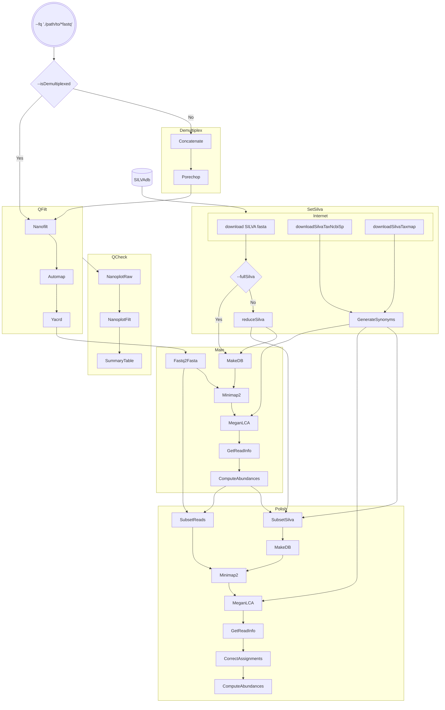

[](https://www.nextflow.io/)

# Porefile: a Nextflow full-length 16S profiling pipeline for ONT reads


## Introduction
`Porefile` is a Nextflow pipeline that wraps a bunch of third-party software to process and classify full length 16S (SSU) long reads generated using Oxford Nanopore sequencing, against the [SILVAdb](https://www.arb-silva.de/) SSU NR99 database, which is downloaded on the fly if not provided by the user.

Reads are then classified by [MEGAN6 CE](https://software-ab.informatik.uni-tuebingen.de/download/megan6/welcome.html) tools, and using a SILVA-to-NCBI accession mapping file generated on-the-fly. 

Porefile uses SILVA SSU NR99 version 138.1 by default, which is the latest available up to this date (Feb 2023). If a new version were released, users can manually provide the new links to tell `Porefile` to download it.

Contents:
  - [Introduction](#introduction)
  - [Workflow scheme](#workflow-scheme)
  - [Running Porefile](#running-porefile)
  - [Help](#help)
  - [Dependencies](#dependencies)
      - [Dependencies included in the container](#dependencies-included-in-the-container)
  - [Profiles](#profiles)
      - [Container engines](#container-engines)
      - [Other configuration (for dev mostly)](#other-configuration-for-dev-mostly)
  - [Usage](#usage)
  - [Output files](#output-files)
  - [Citation](#citation)
  
## Workflow scheme


## Running Porefile
A typical command for running the pipeline would be as follows:
```sh
nextflow run microgenlab/porefile --fq 'path/to/*.fastq' -profile docker
```

If a local copy of the required SILVAdb files were provided, the workflow avoids re downloading it:
```
nextflow run microgenlab/porefile --fq "./fastq/*.fastq" \
    --silvaFasta "./SILVA_138.1_SSURef_NR99_tax_silva.fasta.gz" \
    --silvaTaxNcbiSp "./tax_ncbi-species_ssu_ref_nr99_138.1.txt.gz" \
    --silvaTaxmap "./taxmap_slv_ssu_ref_nr_138.1.txt.gz" \
    -profile docker
```

## Help
Run the following for more details about parameter tuning:
```
nextflow run microgenlab/porefile --help
```

## Dependencies
Install [Nextflow](https://www.nextflow.io/) and at least one of the following container engines: Docker, Singularity/Apptainer, Podman.

All workflow dependencies have been packaged into a [docker container](https://hub.docker.com/repository/docker/iferres/porefile), which is automatically downloaded when the pipeline is executed. That's it, you don't need to install any other software on your own.

Porefile has been tested with each three mencioned container technologies.

#### Dependencies included in the container

Dependencies used by the pipeline and included in the container are:
 * [Porechop](https://github.com/rrwick/Porechop) (Demultiplex)
 * [NanoFilt](https://github.com/wdecoster/nanofilt/) (Quality filtering)
 * [Yacrd](https://github.com/natir/yacrd) (Chimera removal)
 * [NanoPlot](https://github.com/wdecoster/NanoPlot) (Quality check)
 * [seqkit](https://github.com/shenwei356/seqkit/) (fastq/fasta manipulation)
 * [minimap2](https://github.com/lh3/minimap2) (Alignment)
 * [R](https://www.r-project.org/) (Processing)
 * [MEGAN6](https://software-ab.informatik.uni-tuebingen.de/download/megan6/welcome.html) (Taxonomy assignment)

If you use Porefile, please also cite them since we are _**standing on the shoulders of giants**_. Also cite [SILVAdb](https://www.arb-silva.de/), and [Nextflow](https://www.nature.com/articles/nbt.3820%7B).

## Profiles
Porefile comes with a minimal set of configuration profiles. Please, refer to [Nextflow documentation](https://www.nextflow.io/) to create a configuration file for your HPC infrastructure.

#### Container engines
 * Use `-profile docker` to run the pipeline using [Docker](https://www.docker.com/). 
 * Use `-profile singularity` to run the pipeline using [Singularity/Apptainer](https://apptainer.org/). 
 * Use `-profile podman` to run the pipeline using [Podman](https://podman.io/). 

 #### Other configuration (for dev mostly)
  * `-profile test`: Tests the pipeline on a local machine with low resources using a toy dataset (5K ONT reads) included in the repo. Mostly used to develop on my desktop machine. Assigns at most 16Gb of RAM and 4 cpus per process. To run the test using (say) Singularity as container engine (takes about ~5min on a Intel Core i7-4790, 32Gb RAM):
  `nextflow run microgenlab/porefile -profile test,singularity`
  * `-profile nagual`: Configuration to use at IPMont servers.

## Usage

```
Usage:
A typical command for running the pipeline would be as follows:

    nextflow run microgenlab/porefile --fq 'data/*.fastq'

Input fastq file(s):
    --fq                          Path to input data (must be surrounded with quotes).

Other:
    --silvaFasta                  Path to SILVA_*_SSURef_NR99_tax_silva.fasta.gz file. You can provide it
                                  either compressed (.gz) or not. If not provided, the workflow automatically
                                  adds a download step (you must have internet connection).
    --silvaFastaURL               URL to SILVA_*_SSURef_NR99_tax_silva.fasta.gz file. It will be used if you
                                  don't provide the --silvaFasta parameter (above). Default is:
                                  'https://www.arb-silva.de/fileadmin/silva_databases/current/Exports/SILVA_138.1_SSURef_NR99_tax_silva.fasta.gz'.

    --silvaTaxNcbiSp              Path to tax_ncbi-species_ssu_ref_nr99_*.txt.gz file. You can provide it
                                  either compressed (.gz) or not. If not provided, the workflow automatically
                                  adds a download step.
    --silvaTaxNcbiSpURL          URL to tax_ncbi-species_ssu_ref_nr99_*.txt.gz file. It will be used if you
                                  don't provide the --silvaFasta parameter (above). Default is:
                                  'https://www.arb-silva.de/fileadmin/silva_databases/current/Exports/taxonomy/ncbi/tax_ncbi-species_ssu_ref_nr99_138.1.txt.gz'.

    --silvaTaxmap                 Path to taxmap_slv_ssu_ref_nr_*.txt.gz file. You can provide it
                                  either compressed (.gz) or not. If not provided, the workflow automatically
                                  adds a download step.
    --silvaTaxmapURL              URL to taxmap_slv_ssu_ref_nr_*.txt.gz file. It will be used if you
                                  don't provide the --silvaFasta parameter (above). Default is:
                                  'https://www.arb-silva.de/fileadmin/silva_databases/current/Exports/taxonomy/taxmap_slv_ssu_ref_nr_138.1.txt.gz'.

    --fullSilva                   By default, porefile reduces SILVA to prokatyote SSU (16S). Use this flag
                                  to deactivate the reducing step and use the full SILVA database.

    --outdir                      Name of the results directory. Default: "results".


Process specific parameters:
    Porechop parameters:
    --porechop_extra_end_trim      The '--extra_end_trim' parameter of Porechop. Default: 0.

    NanoFilt parameters:
    --nanofilt_quality            The '--quality' parameter of NanoFilt. Default: 8.
    --nanofilt_length             The '--length' parameter of NanoFilt (minimum length). Default: 1000.
    --nanofilt_maxlength          The '--maxlength' parameter of NanoFilt. Default: 1700.
    --nanofilt_headcrop           The '--headcrop' parameter of NanoFilt. Default: 0.
    --nanofilt_tailcrop           The '--tailcrop' parameter of NanoFilt. Default: 0.

    Yacrd parameters:
    --yacrd_c                     The '-c' parameter of Yacrd (minimum coverage). Default: 4 .
    --yacrd_n                     The '-n' parameter of Yacrd (minimum coverage of read). Default: 0.4 .

    Minimap2 parameters:
    --minimap2_k                  The '-k' parameter of minimap2. Default: 15.
    --minimap2_x                  The '-x' parameter of minimap2. Default: 'map-ont'. Possible values: 'map-ont',
                                  'asm5', 'asm10', 'asm20', 'map-pb', or 'map-hifi'. 
    --minimap2_f                  The '-f' parameter of minimap2. Default: 1000. Only applied in the Automap module.
    --minimap2_KM                 The '-K' parameter of minimap2, in Megabases. Default: 200.

    Megan6 parameters:
    --megan_lcaAlgorithm          The '--lcaAlgorithm' parameter of sam2rma tool (Megan6). Default: 'naive'.
                                  Possible values are: 'naive', 'weighted', or 'longReads'.
    --megan_topPercent            The '--topPercent' parameter of sam2rma tool (Megan6). Default: 10.
    --megan_topPercentPolish      The '--topPercent' parameter of sam2rma tool (Megan6) applied when polishing step
                                  is activated. Default: 5.
    --megan_minPercentReadCover   The '--minPercentReadCover' parameter of sam2rma and blast2rma tools (Megan6).
                                  Default: 70.
    --megan_lcaCoveragePercent    The '--lcaCoveragePercent' parameter of sam2rma and blast2rma tools (Megan6).
                                  Default: 100.


Other control options:
    --isDemultiplexed             Set this flag to avoid Demultiplex sub-workflow. If set, each fastq file is
    --removeChimeras              Set this flag to activate the chimera-removing step with Yacrd.
                                  processed as a different barcode.
    --noNanoplot                  Set this flag to avoid QCheck sub-workflow.
    --noSpeciesPolishing          Avoid the polishing sub-workflow.
    --lowAbundanceThreshold       The threshold of total abundance (counts) to be considered as "low", and
                                  which the pipeline will try to re assign.


Container options (note single dash usage!):
    -profile docker               Use docker as container engine (default).
    -profile singularity          Use singularity as container engine.
    -profile podman               Use podman as container engine.

Help:
    --help                        Print this help and exit.
```

## Output files
The `results` directory contains the following directories/files:
```
results/
├── COUNTS.tsv
├── COUNTS_polished.tsv
├── TAXCLA.tsv
├── TAXCLA_polished.tsv
├── Read_Assignments/
│   ├── BC01.read_info
│   ├── BC02.read_info
│   └── ...
├── Read_Assignments_Polished/
│   ├── BC01_polished.read_info
│   ├── BC02_polished.read_info
│   └──...
├── NanoPlots/
│   ├── BC01/
│   ├── BC02/
│   ├── ...
│   └── summary.tsv
├── Rma/
│   ├── BC01.rma
│   ├── BC02.rma
│   └── ...
├── silva_to_NCBI_synonyms.map
└── versions.txt
```
`COUNTS.tsv` and `COUNTS_polished.tsv` are a tabular text files with the counts for each taxa (rows), on each barcode (columns).
```
                BC01    BC02    BC03    ...
TAXA_001        1       0       0       ...
TAXA_002        4       0       0       ...
TAXA_003        0       3       10      ... 
...
```
`TAXCLA.tsv` and `TAXCLA_polished.tsv` are tabular text files with the taxon path classification of each taxa.
```
                Kingdom Phylum  Class   Order   Family  Genus   Species
TAXA_001        Bacteria        NA      NA      NA      NA      NA      NA
TAXA_002        Bacteria        Proteobacteria  Alphaproteobacteria     Rhodobacterales Rhodobacteraceae               Paracoccus      NA
TAXA_003        Bacteria        Proteobacteria  Gammaproteobacteria     Pseudomonadales Pseudomonadaceae               Pseudomonas     NA
...
```
Take into account that the `TAXA` labels are arbitrarily generated for each pipeline, so the `TAXA` labels in `TAXCLA.tsv` do not match the ones in `TAXCLA_polished.tsv` (and the same to the `COUNTS*` files).

The `Read_Assignments` and `Read_Assignments_Polished` contains taxonomic classification for each read.
```
001e48d4-cacc-4f78-b5f4-1b578a652ab2_0_1409     C       186801  [D] Bacteria; [P] Firmicutes; [C] Clostridia;
027b1258-66df-4703-bfe8-bf93957a142d_0_1409     F       171552  [D] Bacteria; [P] Bacteroidetes; [C] Bacteroidia; [O] Bacteroidales; [F] Prevotellaceae;
029f8418-4d6a-46b9-a98f-e0784e620fa2_0_1464     F       541000  [D] Bacteria; [P] Firmicutes; [C] Clostridia; [O] Clostridiales; [F] Ruminococcaceae;
...
```
The columns correspond to: 1) Read id (header); 2) Taxonomic rank at which each read was possible to assign; 3) NCBI id of each taxon; 4) The taxon path assigned to each read.

The `NanoPlots/` directory contain QC plots (see [NanoPlot](https://github.com/wdecoster/NanoPlot)), pre and post filtering, and a summary tabular data file.

The `Rma/` directory contains binary `.rma` files which can be analyzed with MEGAN. There isn't an equivalent directory for the polished pipeline since the second LCA assignment is done only with a subset of reads, and then `porefile` re-writes the base algorithm's assignments.

The `silva_to_NCBI_synonyms.map` is the SILVA to NCBI synonyms mapping file generated on-the-fly by using SILVA's `tax_ncbi-species` and `taxmap` files.

The `versions.txt` prints the versions of the porefile dependencies.


## Citation
A manuscript is under preparation.
